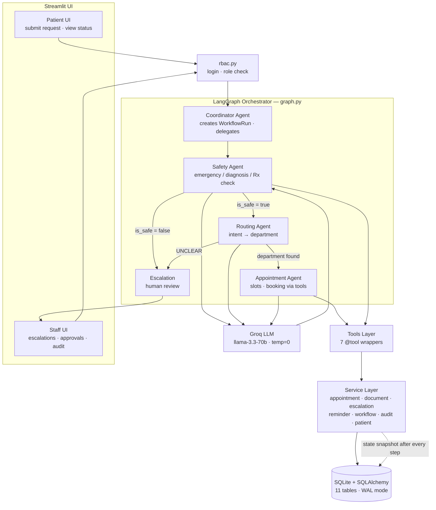

# 🏥 AgentCare — Agentic AI for Patient Administration -AgentCare Hackathon 2026

A multi-agent healthcare administration system that handles a patient's **non-clinical** journey — request intake, department routing, appointment booking, document collection, reminders, and human escalation — built for the AgentCare Build Challenge 2026.

**This is not a medical advice system.** It never diagnoses, prescribes, or recommends treatment. Every uncertain or unsafe request escalates to a human. That boundary is enforced in code and prompts, not just stated.

## Stack

| Layer | Choice |
|---|---|
| Language | Python 3.12 |
| Agents / Orchestration | LangGraph (StateGraph, conditional edges) |
| LLM | Groq — llama-3.3-70b-versatile, temperature=0 |
| Database | SQLite + SQLAlchemy ORM (WAL mode), 11 tables |
| UI | Streamlit (patient portal + staff dashboard) |
| Auth | bcrypt password hashing, backend role enforcement |
| Env management | uv |

## Architecture



## The Four Agents

Each agent has its own system prompt, its own responsibility, and its own state fields. State (a 13-field `AgentState` TypedDict) flows through the graph and is snapshotted to the `WorkflowRun` table after every step — a crash leaves a queryable record of exactly where the run stopped.

1. **Coordinator** — resolves the patient, creates the `WorkflowRun`, builds initial state, finalizes the outcome (confirmation, reminders, or escalation message).
2. **Safety Agent** — classifies every message first. Emergency language, diagnosis requests, or medication requests → `is_safe=false`, escalation record created. Fails safe: any parse error or exception escalates rather than proceeds.
3. **Routing Agent** — maps stated administrative intent to a department. The department list is injected into the prompt from a live DB query. It never infers a department from symptoms (that would be a medical judgment) — symptom-only messages route to `UNCLEAR` → human review. LLM output is validated against real department IDs before use.
4. **Appointment Agent** — a genuine tool-calling loop: the LLM calls `list_available_slots`, reads real slot data, chooses, calls `book_slot`. Patient identity is injected from server-side state, never taken from the LLM. Named-doctor preferences are binding — if the requested doctor has no slots, it reports no availability rather than silently substituting.

## Design Decisions Worth Noting

- **Every failure path degrades toward human review** — LLM parse errors, invalid IDs, iteration caps, empty slot lists. Nothing fails toward autonomous action.
- **LLM decides, code verifies** — routing output is checked against valid department IDs; booking goes through conflict checks in the service layer.
- **RBAC in the backend** — every sensitive service function checks `actor_role`; the UI hiding buttons is cosmetic, not the control.
- **Append-only audit trail** — every booking, escalation, resolution, and document action writes an `AuditEvent`.
- **Config-driven** — model, keys, DB URL all come from `.env`; swapping the LLM is a one-line change.

Deferred items are documented with rationale in [FUTURE_ENHANCEMENTS.md](FUTURE_ENHANCEMENTS.md).

## Setup

```bash
# 1. Clone
git clone https://github.com/lavanyamdata/agentcare.git
cd agentcare

# 2. Environment (uv)
uv venv
.venv\Scripts\activate        # Windows
# source .venv/bin/activate   # macOS/Linux
uv pip install -r requirements.txt

# 3. Configuration
copy .env.example .env        # then edit .env and add your GROQ_API_KEY
# Free key: https://console.groq.com

# 4. Database + synthetic seed data
python -m app.database.seed   # users, departments, doctors, base slots
python add_slots.py           # future-dated appointment slots (relative to today)

# 5. Run
streamlit run main.py
# open http://localhost:8501
```

## Demo Accounts (synthetic data only)

| Role | Email | Password |
|---|---|---|
| Patient | ravi@example.com | Patient@123 |
| Staff | admin@agentcare.dev | Staff@123 |

## Try These Flows

| Type this as a patient | What happens |
|---|---|
| *"I need a cardiology appointment next week"* | Safety ✓ → routed to Cardiology → real slot booked → confirmation from persisted data + reminder created |
| *"I have chest pain, what medication should I take?"* | Safety agent blocks → escalation record → staff sees it in dashboard |
| *"My knees ache when I climb stairs"* | Routing refuses to guess from symptoms → UNCLEAR → human review |
| *"Appointment with Dr. Priya Nair next week"* | Books that doctor specifically, or reports no availability — never substitutes |

Then log in as staff: review the escalations, approve/reject with notes, and inspect the workflow runs and audit log.

## Tests

```bash
python test_e2e.py        # full pipeline: happy path, unsafe escalation, UNCLEAR routing
python test_services.py   # service layer
```

## Project Structure

```
app/
├── agents/          # safety, routing, appointment, coordinator
├── orchestrator/    # state.py (AgentState), graph.py (LangGraph wiring)
├── tools/           # 7 @tool wrappers agents can invoke
├── services/        # business logic: appointments, documents, escalations,
│                    # reminders, workflow persistence, audit, patients
├── auth/            # rbac.py — authentication + role enforcement
├── database/        # models (11 tables), session, seed
├── ui/              # patient_ui.py, staff_ui.py
└── config.py        # env-driven configuration
main.py              # Streamlit entry: login + routing by role
```